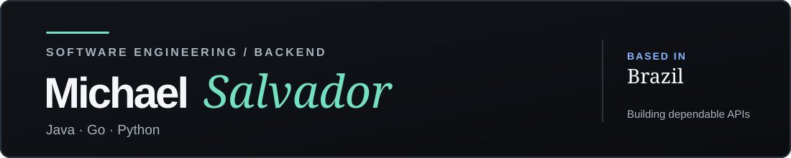

I'm a Computer Science undergraduate at UniFil. I build backend APIs and local tools, with an interest in transactions, concurrency, and cloud systems. I'm open to internships and junior backend roles.

[Portfolio · PT](https://michaelalexandredev.github.io/) · [Portfolio · EN](https://michaelalexandredev.github.io/en.html) · [Resume · PT](https://michaelalexandredev.github.io/resumes/pt-br/curriculo.pdf) · [Resume · EN](https://michaelalexandredev.github.io/resumes/en/resume.pdf) · [LinkedIn](https://www.linkedin.com/in/michael-alexandre-215b60380/) · [Email](mailto:michaelsralt@gmail.com)

## Selected work

### [Wallet API](https://github.com/MichaelAlexandreDev/wallet-api)

Atomic wallet transfers with ordered row locks, external authorization, and persistent notification retries. 
Java · Spring · PostgreSQL · 49 tests

### [Ayvu](https://github.com/MichaelAlexandreDev/ayvu)

Local EPUB translation that keeps the original intact, with SQLite cache, translation memory, CSV review, and output validation. 
Python · 330 automated tests

### [Tailwarden](https://github.com/MichaelAlexandreDev/tailwarden)

AWS Lambda inventory across regions with pagination, separate worker limits for regions and tags, and partial-failure warnings. 
Go · AWS · 16 tests

**Also building:** [Lume](https://github.com/MichaelAlexandreDev/Lume), a programming language with 191 passing integration scenarios; and [HookForge](https://github.com/MichaelAlexandreDev/hookforge), a webhook platform in active development.

## Toolkit

Java · Go · Python · SQL · Spring · PostgreSQL · SQLite · AWS · Docker · GitHub Actions · Linux

## Highlights

- TCS CodeVita Season 13: global rank 8,005, top 1.3%.
- Oracle Agentic AI Foundations Associate (2026).
