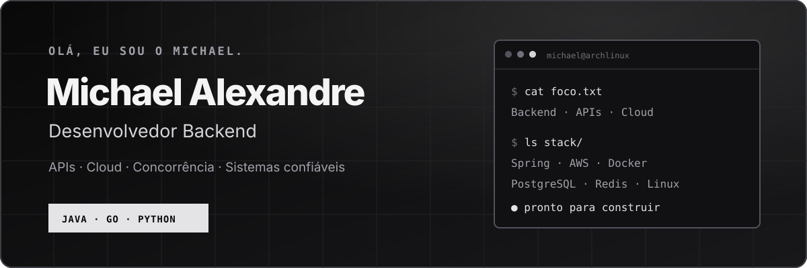

<p align="center">
  <a href="https://devstarrk1137.github.io/">
    
  </a>
</p>

<p align="center">
  Desenvolvedor backend interessado no ponto em que <strong>regras de negócio, concorrência e falhas reais</strong> se encontram.
</p>

<p align="center">
  <a href="https://devstarrk1137.github.io/"></a>
  <a href="https://www.linkedin.com/in/michael-alexandre-215b60380/"></a>
  <a href="mailto:michaelsralt@gmail.com"></a>
</p>

## Construindo agora

### [HookForge](https://github.com/DevStarrk1137/hookforge) `em desenvolvimento`

Uma plataforma para receber e entregar webhooks de forma confiável. É o projeto em que estou praticando o ciclo completo de um sistema orientado a eventos — da ingestão à recuperação de falhas.

```text
evento HTTP  →  ingestão  →  fila  →  entrega
                               ├── retry + backoff
                               ├── idempotência
                               └── dead-letter queue + replay
```

`Java` `Spring Boot` `PostgreSQL` `Redis` `AWS SQS/S3` `React` `Docker`

---

## Projetos que mostram como eu penso

| Projeto | Problema de engenharia explorado |
|---|---|
| **[Wallet API](https://github.com/DevStarrk1137/wallet-api)** | Como preservar saldo e atomicidade quando transferências concorrentes disputam os mesmos recursos? |
| **[Tailwarden](https://github.com/DevStarrk1137/tailwarden)** | Como consultar múltiplas regiões AWS com concorrência controlada e ainda retornar resultados diante de falhas parciais? |
| **[Lume](https://github.com/DevStarrk1137/Lume)** | Como uma linguagem resolve escopo, infere tipos e transforma código-fonte em comportamento executável? |
| **[Ayvu](https://github.com/DevStarrk1137/ayvu)** | Como tornar um processamento longo retomável, cacheável e seguro sem danificar a estrutura de um EPUB? |

Cada repositório inclui documentação técnica, decisões de implementação e instruções para execução.

---

## Caixa de ferramentas

<p>
  
  
  
  
  
  
  
  
  
</p>

| Construção | Confiabilidade | Entrega |
|---|---|---|
| REST, GraphQL, OpenAPI | Transações, locks, idempotência | Docker, GitHub Actions, CI/CD |
| Spring Data JPA, Gin | JUnit, Mockito, Testcontainers, pytest | AWS Lambda, API Gateway, SQS, S3 |
| PostgreSQL, SQLite, Redis | Concorrência, retries, observabilidade | Git, Bash, Arch Linux |

Também estudo **DSA**, orientação a objetos, orquestração de agentes e construção de **agent harnesses**.

---

## Além do código

> **Top 1,3% global · TCS CodeVita Season 13**
>
> Resultado em competição internacional de programação.

- Ciência da Computação — UniFil
- Oracle Agentic AI Foundations Associate · 2026
- Java Spring Boot Full Stack — EmbarkX/Udemy
- Inglês intermediário

---

## Vamos conversar

Estou aberto a oportunidades de **desenvolvimento backend, estágio e posições júnior**.

**[Portfólio](https://devstarrk1137.github.io/)** · **[LinkedIn](https://www.linkedin.com/in/michael-alexandre-215b60380/)** · **[michaelsralt@gmail.com](mailto:michaelsralt@gmail.com)**
