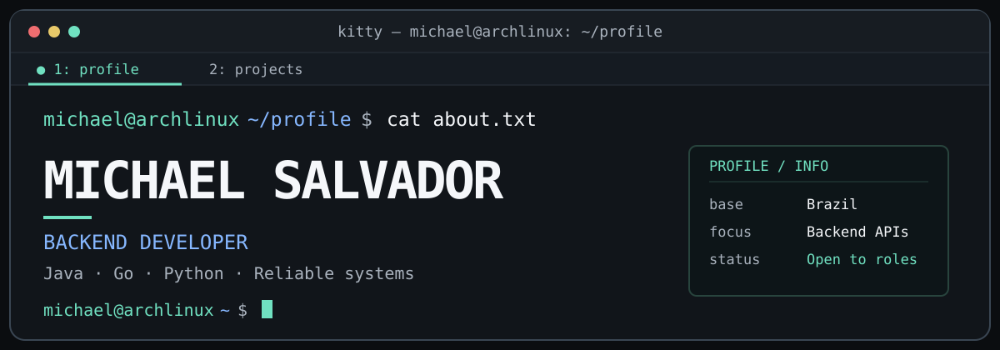

<div align="center">
  
  <p><strong>Michael Alexandre Schimitt Salvador · Backend Developer</strong></p>
  <p>
    <a href="https://michaelalexandredev.github.io/">🇧🇷 Portfólio</a> ·
    <a href="https://michaelalexandredev.github.io/en.html">🇺🇸 Portfolio</a> ·
    <a href="https://michaelalexandredev.github.io/resumes/pt-br/curriculo.pdf">Currículo PT</a> ·
    <a href="https://michaelalexandredev.github.io/resumes/en/resume.pdf">Resume EN</a>
  </p>
</div>

```console
michael@archlinux:~/profile$ whoami
Michael Salvador
Computer Science undergraduate and backend developer from Brazil.

michael@archlinux:~/profile$ cat focus.txt
Reliable backend systems · APIs · Concurrency · Cloud

michael@archlinux:~/profile$ status
● open to internships and junior backend roles
```

## `$ ls -lh ~/projects/`

- **[wallet-api/](https://github.com/MichaelAlexandreDev/wallet-api)** — Monetary invariants, atomic transfers, deterministic pessimistic locking, external authorization, and durable notification retries.<br>
  `tests: 49 · 28 integration · 14 HTTP client · 7 domain`
- **[ayvu/](https://github.com/MichaelAlexandreDev/ayvu)** — Local-first EPUB translation and review, structure preservation, SQLite cache, checkpoints, translation memory, concurrency controls, and output validation.<br>
  `tests: 330 across 21 files` · Implemented scope is kept separate from the public roadmap.
- **[Lume/](https://github.com/MichaelAlexandreDev/Lume)** — Programming language with static inference, closures, classes, traits, typed collections, modules, and a REPL.<br>
  `191 passing integration scenarios` · No external Java library at runtime.
- **[tailwarden/](https://github.com/MichaelAlexandreDev/tailwarden)** — Cross-region AWS Lambda inventory with SDK pagination, bounded worker pools, deterministic ordering, filters, and partial-failure responses.<br>
  `16 tests` · No real AWS account needed.
- **[hookforge/](https://github.com/MichaelAlexandreDev/hookforge)** — JWT authentication, per-user project and endpoint management, and persistent webhook ingestion.<br>
  `status: active development` · Delivered features and upcoming milestones are documented separately.

## `$ cat ~/.config/stack.txt`

```text
Languages      Java 17 · Java 21 · Go · Python 3.11+ · SQL · Bash
Backend & APIs Spring Framework · REST · GraphQL · gRPC
Data           PostgreSQL · SQLite · Redis · Flyway
Cloud          AWS Lambda · API Gateway · SDK for Go v2 · SAM · IAM
Delivery       Docker · Docker Compose · GitHub Actions · CI/CD · Git · Linux
Testing        JUnit 5 · Mockito · Testcontainers · pytest · Go test
Foundations    Concurrency · Transactions · OOP · Data structures · Algorithms
```

## `$ tail -n 5 ~/highlights.log`

- **TCS CodeVita Season 13:** global rank 8,005 — top 1.3% in an international programming competition.
- **Computer Science:** B.S. candidate at UniFil.
- **Oracle (2026):** Oracle Agentic AI Foundations Associate.
- **Current studies:** distributed systems, system design, algorithms and data structures, and AI engineering.
- **English:** intermediate proficiency.

## `$ cat ~/contact.txt`

[Portfolio](https://michaelalexandredev.github.io/) ·
[LinkedIn](https://www.linkedin.com/in/michael-alexandre-215b60380/) ·
[Email](mailto:michaelsralt@gmail.com)
